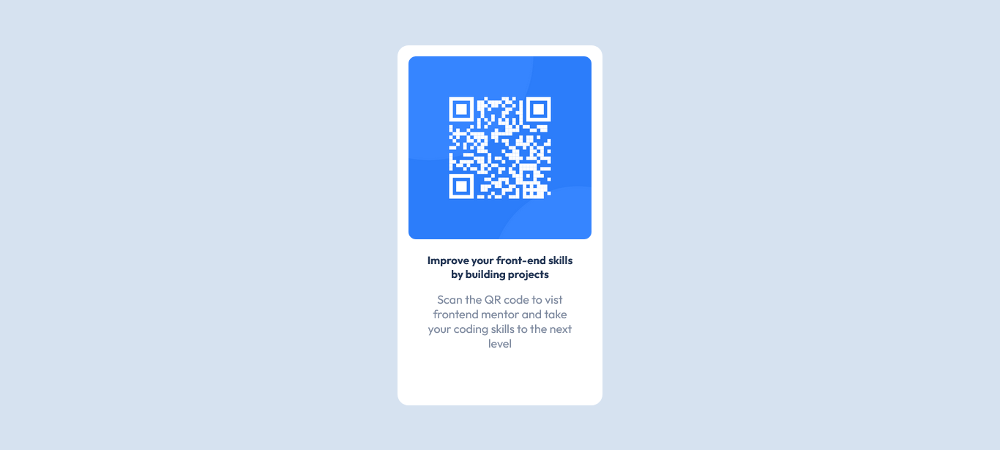

# Frontend Mentor - QR code component solution

This is a solution to the [QR code component challenge on Frontend Mentor](https://www.frontendmentor.io/challenges/qr-code-component-iux_sIO_H). Frontend Mentor challenges help you improve your coding skills by building realistic projects. 

## Table of contents

- [Overview](#overview)
  - [Screenshot](#screenshot)
  - [Links](#links)
- [My process](#my-process)
  - [Built with](#built-with)
  - [Useful resources](#useful-resources)
- [Author](#author)

## Overview

### Screenshot

### Links

- Solution URL: [Add solution URL here](https://your-solution-url.com)
- Live Site URL: [Add live site URL here](https://qrcarddesign.netlify.app/)

## My process

### Built with

- Semantic HTML5 markup
- CSS custom properties
- Flexbox
- CSS Grid
- Mobile-first workflow

### Useful resources

- [Example resource 1](https://developer.mozilla.org/en-US/docs/Web/CSS/font-size-adjust) - This is an amazing article which helped me finally understand font-adjust. I'd recommend it to anyone still learning this concept.

## Author

- linkedIn - [Ani Michael Chijindu](https://www.your-site.com)
- Frontend Mentor - [@mickey2143](https://www.frontendmentor.io/profile/yourusername)
- Twitter - [@MYKELJI](https://www.twitter.com/MYKELJI)